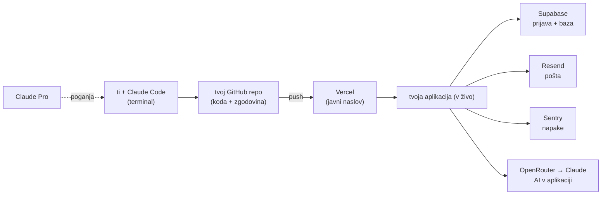

<!-- Summary: Day-1 big picture — the three tool groups, the architecture diagram, why this order, and the foundational agent concepts. -->
# 00 · Pregled — kaj postavljamo in kako se vse poveže

> **Agent:** to je prva postaja. Najprej pokaži *veliko sliko*, da uporabnik razume, čemu orodja služijo, preden karkoli nameščamo. Pokaži diagram arhitekture (`diagrami.md`).

## Kaj danes počnemo

Danes **ne gradimo aplikacije** — danes **postavimo orodja in račune** ter razumemo, kako se povezujejo. Od torka naprej s temi orodji gradiš. Ponedeljek je edini dan za nastavitev; zato ga opravimo temeljito in varno.

Orodja sodijo v **tri skupine**:

1. **Tvoja delovna miza (gradnja).** `Claude Code` v terminalu piše kodo; `GitHub` hrani kodo **in njeno zgodovino**; `Vercel` jo postavi na splet.
2. **Storitve varnostne mreže (kupljene).** `Supabase` (prijava + baza), `Resend` (pošta), `Sentry` (napake). Teh **ne gradiš sam** — plačaš ekipo, ki to počne varno.
3. **AI / modelni sloj.** `Claude Pro` poganja Claude Code; `OpenRouter` je dostop do modelov za tvojega agenta (Dan 4) in za AI v tvoji aplikaciji (Dan 2–3).

## Kako se vse poveže

Beri od leve: **ti** govoriš s Claude Code → ta piše kodo v **tvoj GitHub repo** → vsak `push` sproži **Vercel**, ki aplikacijo objavi na **javnem naslovu**. Med delovanjem se aplikacija opira na **Supabase / Resend / Sentry** in po potrebi kliče **AI prek OpenRouterja**.

## Zakaj ravno ta vrstni red

Vrstni red ni naključen — postaje so odvisne ena od druge:

- **GitHub je prvi**, ker se v **Vercel in Supabase prijaviš *prek* GitHuba** (manj gesel, povezave „kar delujejo").
- **Claude Pro** mora obstajati, ker **poganja Claude Code** — brez njega se Claude Code ne prijavi.
- **OpenRouter** dobi **spend cap** takoj ob nastavitvi — še preden ga uporabimo.
- Na koncu vse skupaj preveri **`preflight`** skripta (`10-...`).

## Trije pojmi, ki držijo vse skupaj

Te boš slišal cel teden — danes pri Claude Code, v četrtek pri Hermesu:

- **Krog agenta:** `READ → PLAN → ACT → OBSERVE → ITERATE`. Agent prebere kontekst, naredi načrt, ukrepa, opazuje izid in ponovi.
- **Zanesljivost = `context` / `boundaries` / `caps`.** Kaj agent *ve*, kaj *sme* in *kako daleč* sme. Brez vseh treh mu ne zaupaš naloge.
- **Načini dela:** `HITL` (ti vodiš) → `Supervised` (gledaš) → `Autonomous` (sam — zasluži se, ni privzeto). Ta teden ostajamo levo.

> **Naslednja postaja:** [`01-varnost-najprej.md`](01-varnost-najprej.md) — varnostni model, ki velja povsod.
