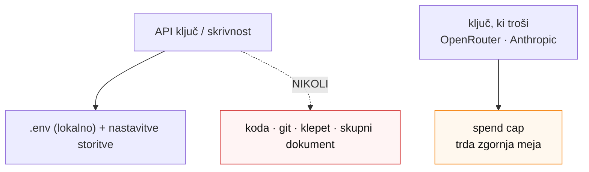

<!-- Summary: the cross-cutting security-first model — five rules with reasoning, the two kinds of keys, the spend-cap model. -->
# 01 · 🔒 Varnost najprej — model, ki velja povsod

> **Agent:** predstavi to na začetku in se nanj **vračaj pri vsaki postaji**. To ni dodatek — to je način, kako delamo. Pokaži diagram „varnostni / spend-cap model" iz `diagrami.md`.

Gradiš programsko opremo z agentom in z resničnimi računi. Pet pravil te varuje pred tremi nevarnostmi: **ukraden ključ**, **presenetljiv račun** in **razkriti podatki strank**.

## 1. Skrivnosti nikoli v kodo, klepet ali skupni dokument
`API ključi` in gesla živijo **samo** v `.env` datotekah na tvoji napravi in v nastavitvah storitev (npr. Vercel).
- **Zakaj:** ključ v kodi ali v javnem repu lahko kdorkoli prebere — in z njim troši tvoj denar ali bere tvoje podatke. Ključ, enkrat objavljen v git zgodovini, **ostane tam za vedno**.
- **Kako:** `.gitignore` v predlogi že skrbi, da `.env*` nikoli ne gre v GitHub. Pusti tako. Ključa **ne lepi v ta pogovor** z agentom.

## 2. Spend cap na vsem, kar troši
`OpenRouter` in `Anthropic` ključi lahko trošijo denar. Vsak dobi **trdo omejitev (`spend cap`)**.
- **Zakaj:** omejen ključ **ne more** preseči zneska, ki si ga določil — tudi ob napaki ali zlorabi. To je tvoja varnostna mreža za stroške.
- **Kako:** OpenRouter → ključu nastaviš `hard limit` (npr. €10–20). Anthropic → mesečni cap (npr. €50). Podrobno: [`07-anthropic-in-openrouter.md`](07-anthropic-in-openrouter.md).

## 3. „Kupi, ne gradi" za varnostno kritično
Prijave, pošiljanja pošte in beleženja napak **nikoli ne delaš sam** — to prevzamejo `Supabase`, `Resend`, `Sentry`.
- **Zakaj:** te storitve imajo varnostne ekipe; ti imaš podjetje, ki ga moraš voditi. Lastna prijava je najpogostejši vir vdorov — ena napaka in cela tabela strank je odprta.

## 4. Zaseben repo, brez skrivnosti v njem
Tvoj GitHub repo je **zaseben (`private`)**; skrivnosti vanj ne gredo nikoli.
- **Zakaj in pozor — dve *ločeni* nastavitvi:** repo je **zaseben** (vidiš ga samo ti), spletna stran pa je **javna** (vidijo jo obiskovalci). Oboje hočeš hkrati. → `03-github.md`, `04-vercel.md`.

## 5. Vsi računi tvoji; agent dobi svoje (Dan 4)
Program ne uporablja skupnih računov. V četrtek (Hermes) agent dobi **svoje** račune (`service account`), nikoli tvojih osebnih gesel. Dohodna sporočila so **nezaupanja vreden vhod** (lahko poskušajo agenta pretentati) — zato `allowlist` in odobritev pred vsakim zapisom.

## Dve vrsti ključev (zapomni si razliko)
- **Javni ključ** (npr. Supabase `anon`): sme v brskalnik; varujejo ga `RLS` pravila v bazi.
- **Skriti/privaten ključ** (`service-role`, `OPENROUTER_API_KEY`, Resend, Sentry DSN …): **samo na strežniku**, nikoli v brskalnik, nikoli s predpono `NEXT_PUBLIC_`.

> **Naslednja postaja:** [`02-claude-code-node.md`](02-claude-code-node.md).
