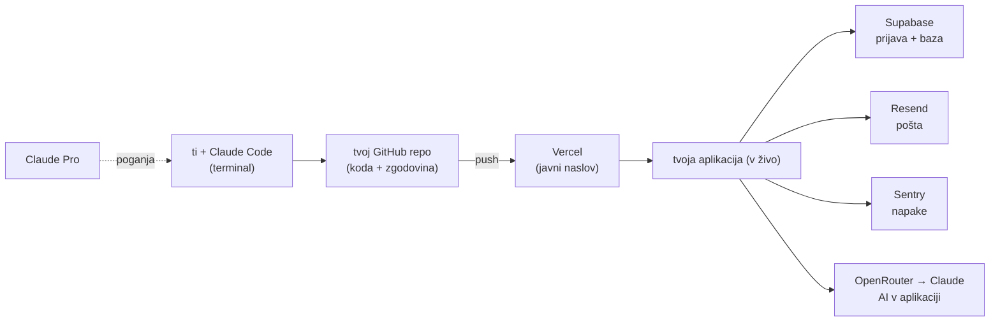
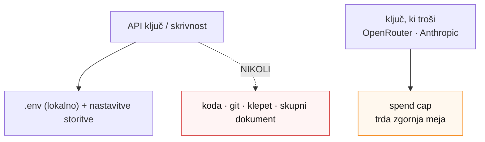
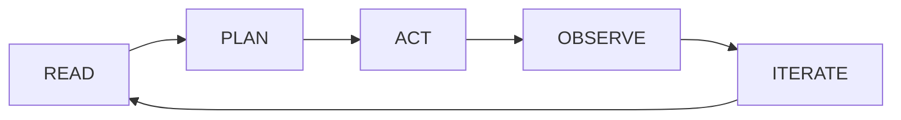
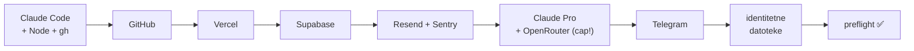

<!-- Summary: all Day-1 diagrams and flows in one place — architecture, GitHub→Vercel pipeline, secrets/spend-cap model, agent loop, station flow. -->
# Diagrami in tokovi

> **Agent:** pokaži ustrezni diagram ob razlagi. Vsi so preprosti — namen je razumevanje, ne popolnost.

## 1. Arhitektura — kako se vse poveže



## 2. Cevovod GitHub → Vercel (push = objava)

```mermaid
flowchart LR
  T["„Use this template"<br/>→ tvoj zaseben repo"] --> C["commit<br/>= shranjevalna točka"]
  C --> P["push"]
  P --> D["Vercel objavi<br/>(~1 min)"]
  C -. "revert ←" .-> H["zgodovina"]
  R2["veja"] -. "→ preview naslov" .-> PV["zasebni testni naslov"]
```

Produkcija je vedno veja `main`. Tvegano spremembo narediš na **veji** (dobiš testni `preview` naslov), nato jo Claude združi v `main`. Razveljaviš z **`revert`** — nikoli `reset --hard` ali force-push.

## 3. Varnostni / spend-cap model



## 4. Krog agenta (velja za Claude Code in Hermes)



`context` (kaj ve) · `boundaries` (kaj sme) · `caps` (kako daleč). Načini: `HITL → Supervised → Autonomous` (ta teden ostajamo levo).

## 5. Postaje Dneva 1 (vrstni red)



Odvisnosti: v **Vercel** in **Supabase** se prijaviš *prek* **GitHuba**; **Claude Pro** poganja **Claude Code**; **OpenRouter** dobi `spend cap` takoj.
